<!-- ═══════════════════════════════════════════════════════════════════════
     HADES · GITHUB PROFILE README
     Custom animated SVG banners live in /assets — hand-coded, no services.
     ═══════════════════════════════════════════════════════════════════════ -->

<div align="center">

<!-- ── Animated hero banner (custom SVG: gradient text, glow orbs, cursor) ── -->



<br/><br/>

<!-- ─────────────────────── Typing animation ─────────────────────── -->

<a href="https://github.com/Hadesfenyx">
  
</a>

<br/><br/>

<!-- ─────────────────────────── Badges ─────────────────────────── -->


&nbsp;

&nbsp;


</div>

<br/>

<!-- ─────────────────────────── About me ─────────────────────────── -->

## 🧑‍💻 About Me

```python
class Hades:
    """AI Developer · 3+ years of turning ideas into intelligent software."""

    def __init__(self):
        self.name = "Hades"
        self.role = "AI Developer"
        self.experience = "3+ years"
        self.building = ["AI-powered applications & tools",
                        "AI-powered video creation"]
        self.mission = "Help developers build faster with AI tools & automation"
        self.sharing = "Tutorials on AI coding — making AI development accessible"

    def current_status(self) -> str:
        return "Shipping — one commit at a time 🚀"


me = Hades()
print(me.current_status())
```

<br/>

<!-- ──────────────── Currently building · What I do ──────────────── -->

<table width="100%">
<tr>
<td width="50%" valign="top">

### 🔭 Currently Building

- 🤖 **AI-powered applications & tools**
- 🎬 **AI-powered video creation**

</td>
<td width="50%" valign="top">

### 💡 What I Do

- 🛠️ **Help developers build faster** with AI tools & automation
- 🎓 **Create tutorials on AI coding**

</td>
</tr>
</table>

<br/>

<!-- ─────────────────────────── Tech stack ─────────────────────────── -->

## 🧰 Tech Stack

<div align="center">

### Core

<a href="https://skillicons.dev">
  
</a>

### AI Arsenal


&nbsp;

&nbsp;


</div>

<br/>

<!-- ─────────────────────── GitHub analytics ─────────────────────── -->

## 📊 GitHub Analytics

<div align="center">


&nbsp;


<br/><br/>


<br/><br/>


<br/><br/>


</div>

<br/>

<!-- ──────────────────── Contribution snake ──────────────────── -->

## 🐍 Contribution Snake

<div align="center">

<picture>
  <source media="(prefers-color-scheme: dark)" srcset="https://raw.githubusercontent.com/Hadesfenyx/Hadesfenyx/output/github-snake-dark.svg" />
  <source media="(prefers-color-scheme: light)" srcset="https://raw.githubusercontent.com/Hadesfenyx/Hadesfenyx/output/github-snake.svg" />
  
</picture>

<sub>Auto-generated every 12 hours by the <code>snake.yml</code> GitHub Action — appears after its first run.</sub>

</div>

<br/>

<!-- ─────────────────────────── Dev quote ─────────────────────────── -->

<div align="center">


</div>

<br/>

<!-- ─────────────────────── Connect with me ─────────────────────── -->

## 🌐 Connect With Me

> 🚧 Social links coming soon — stay tuned!

<!--
  ✏️ When your profiles go live, uncomment the badges below and drop in your URLs:

<div align="center">
  <a href="https://www.youtube.com/@YOUR_CHANNEL">
    
  </a>
  &nbsp;
  <a href="https://x.com/YOUR_HANDLE">
    
  </a>
  &nbsp;
  <a href="https://www.linkedin.com/in/YOUR_PROFILE">
    
  </a>
  &nbsp;
  <a href="https://YOUR_WEBSITE.com">
    
  </a>
</div>
-->

<!-- ═══════════════════ RECENT YOUTUBE VIDEOS (disabled) ═══════════════════

  🎬 To enable an auto-updating "Recent YouTube Videos" section once your
  channel is live:

  1. Uncomment the section markers below.
  2. Create .github/workflows/youtube.yml using the
     gautamkrishnar/blog-post-workflow action with your channel's RSS feed:
     feed_list: "https://www.youtube.com/feeds/videos.xml?channel_id=YOUR_CHANNEL_ID"
  3. The workflow will replace the content between the markers on a schedule.

## 🎬 Recent YouTube Videos

< !-- YOUTUBE:START -- >
< !-- YOUTUBE:END -- >

➡️ [More videos...](https://www.youtube.com/@YOUR_CHANNEL)

═══════════════════════════════════════════════════════════════════════ -->

---

<div align="center">

**⭐ From [Hadesfenyx](https://github.com/Hadesfenyx) — building the future with AI, one commit at a time.**

<br/>

<!-- ── Animated wave footer (custom SVG) ── -->


</div>
